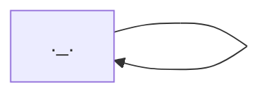

My bog-standard Django project for the [Django for Everybody](https://www.youtube.com/watch?v=o0XbHvKxw7Y) course made by the great [csev](https://github.com/csev).

> [!NOTE]
> You'll have to pardon the over-commenting: I find it helps me think properly about what each line is doing. Hope you like spaghetti :spaghetti:

Hosted on PythonAnywhere: https://jakeinabox.pythonanywhere.com

Enjoy my strange [mermaid](https://mermaid.js.org/) experiments below...

