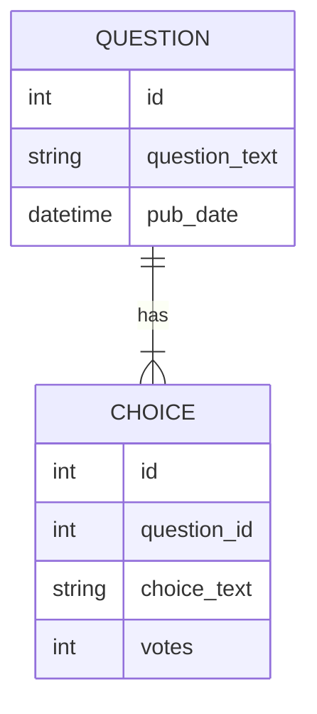
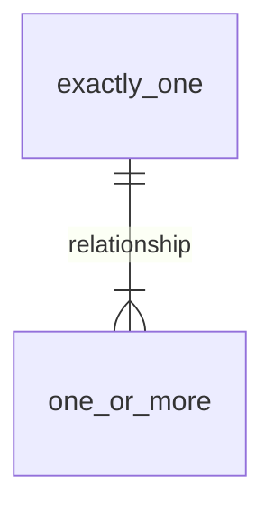

Polls database model using crow's foot notation (entity relationship model)

```mermaid
    erDiagram
    QUESTION ||--|{ CHOICE : has
    QUESTION {
        int id
        string question_text
        datetime pub_date
    }
    CHOICE {
        int id
        int question_id
        string choice_text
        int votes
    }
```
ER diagram key:

```mermaid
    erDiagram
    exactly_one ||--|{ one_or_more : relationship


```
